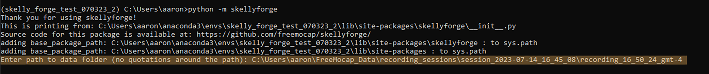
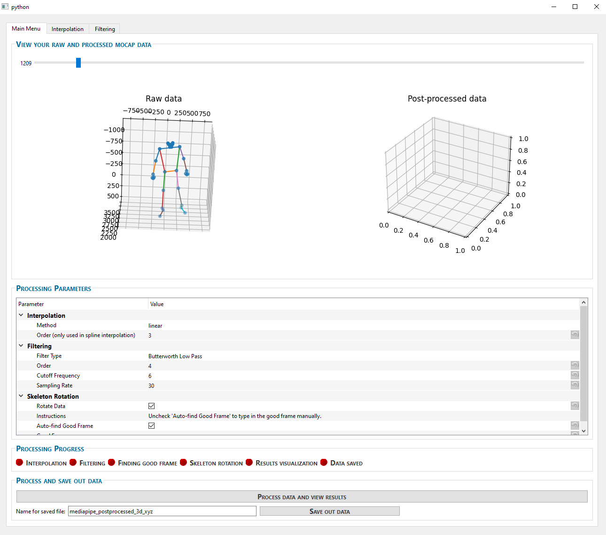
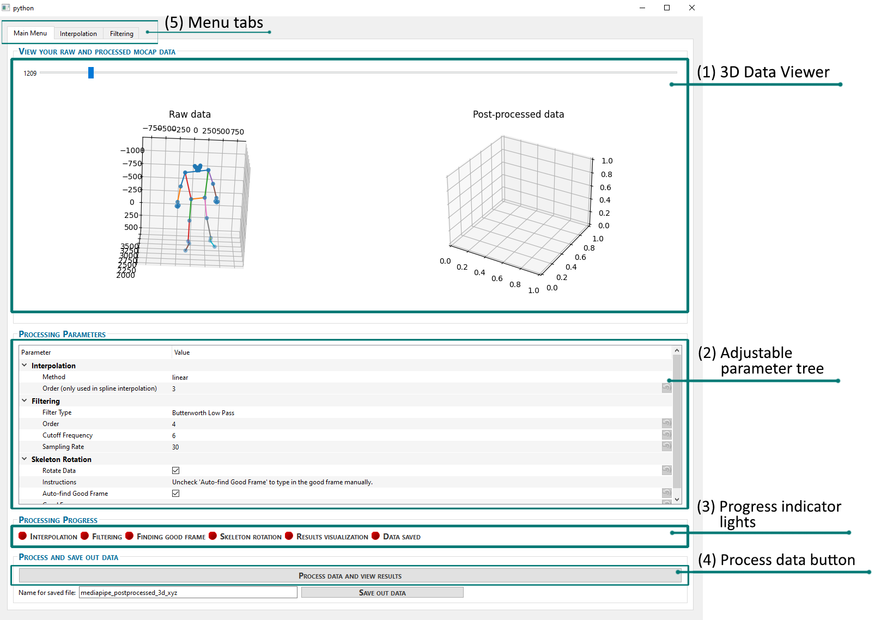

# Getting Started with SkellyForge

Welcome to the SkellyForge Getting Started Guide. Here, we will walk you through the initial steps to get up and running with SkellyForge. 

## Prerequisites

Before you install SkellyForge, ensure that you have a Python environment set up. SkellyForge is compatible with Python 3.8 to 3.11. While it's been tested on Mac and Windows, compatibility with Linux is not yet confirmed.

## Installation

To install SkellyForge, run the following command in your terminal:

```bash
pip install skellyforge
```

## First Run

Use this command to start SkellyForge:

```bash
python -m skellyforge
```
You will then be prompted to provide a path to your recording folder. Make sure you input the path without quotes, as seen in the example below:




Once done, you'll see the SkellyForge Graphical User Interface (GUI) open up.



## Basic Usage



### Examining Your 3D Data
(1) Upon successful launch, you'll find two 3D graphs. The one on the left, labeled 'Raw data', displays the raw 3D reconstruction of the FreeMoCap data. The one on the right, labeled 'Post-processed data', is initially empty, but will fill in with data after processing. Above the graphs, you'll find a slider that allows you to navigate through the different frames.


### Adjusting parameters
(2) A parameter tree on the main page lets you adjust your parameters for interpolation, filtering, and rotation. The default parameters match the default post-processing parameters in the main FreeMoCap GUI.

### Quick Run

(3) The indicator lights will display progress through the various post-processing steps

(4) For a quick run to get started, click on the '**Process Data and View Results**' button to process the data according to the default FreeMoCap parameters and display the post-processed data graph (1).

You can adjust parameters from the tree and press the button again to reprocess data with the new parameters. 


## Exploring the Interface

(5) On top of the interface, you'll find tabs labeled 'Interpolation' and 'Filtering'. These offer an in-depth look into the respective data processing steps.

For example, clicking on the 'Interpolation' tab displays the X, Y, and Z time traces for the raw data. A dropdown menu at the top lets you choose which marker's time series you wish to view.

You'll initially see just the raw data trace plotted. Below this, you'll find the parameters for interpolation. After adjusting these parameters and clicking on 'Run Interpolation', the trace of the processed data will be plotted on top of the raw trace. This allows you to see exactly how your data is being affected by the interpolation.

Changes made in the parameter tree on this page will also automatically reflect in the parameter tree on the Main Menu tab.

The 'Filtering' tab works identically but for the filtering parameters instead.


